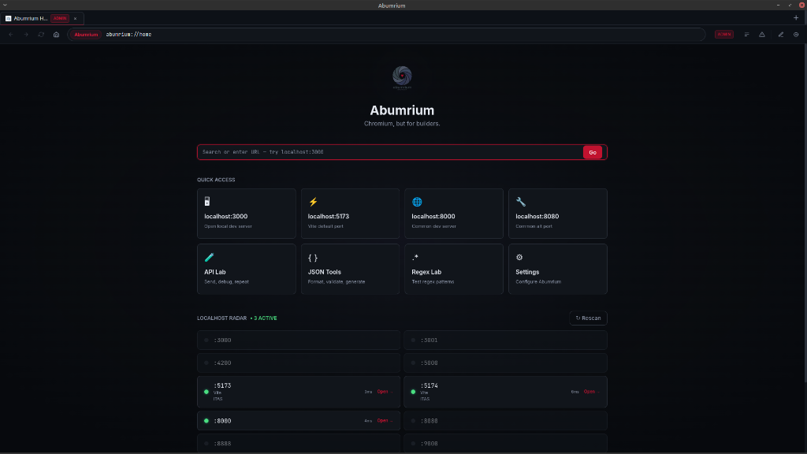
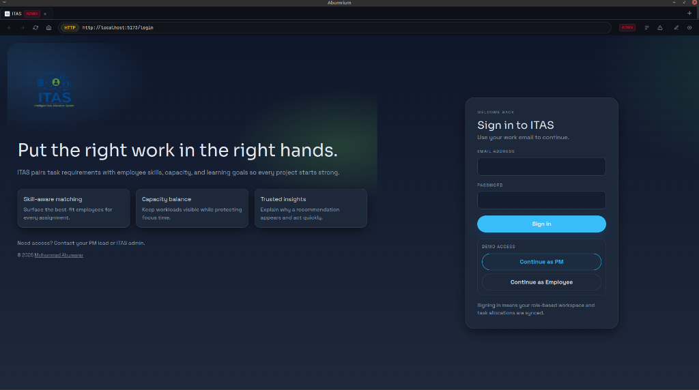
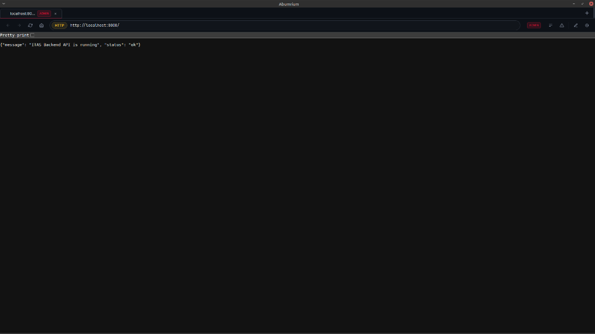
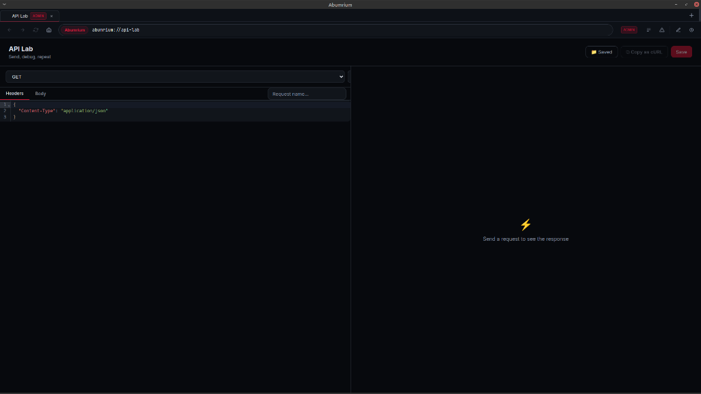
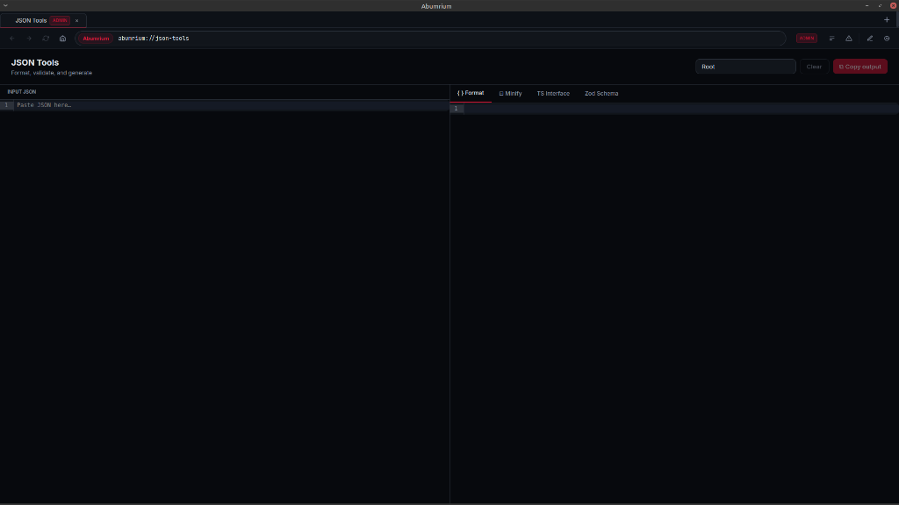

# Abumrium

> **Chromium, but for builders.**
> 
> *Note: This is a personal project created for fun and exploration.*

A developer-focused desktop browser built with Electron (Chromium), React, TypeScript, and Tailwind CSS. Abumrium gives you first-class developer workflows baked directly into the browser: API client, JSON tools, regex lab, container sessions, request inspection, and more.

---

## Screenshots

### 🏠 Dev Home & Localhost Radar


### 🧩 Container Isolation (ITAS Login)


### 🔍 Request Inspection


### ⚡ API Lab


### `{}` JSON Tools


---

## Features (MVP v0.1.0)

### 🌐 Browser Shell
- Multi-tab browsing with container isolation
- Back / Forward / Reload / Home
- Smart address bar (handles URLs, localhost, bare domains, and search terms)
- Loading indicator, favicon, error page
- Frameless window with native title bar controls

### 🏠 Abumrium Dev Home (`abumrium://home`)
- Aperture-inspired dark design
- Quick access grid: localhost ports, API Lab, JSON Tools, Regex Lab, Settings
- **Localhost Radar** — scans common dev ports (3000, 5173, 8080, etc.) and detects frameworks
- Recent URLs history

### ⚡ API Lab (`abumrium://api-lab`)
- Full HTTP client: GET, POST, PUT, PATCH, DELETE, HEAD, OPTIONS
- Headers editor (JSON/CodeMirror)
- Request body editor
- Response viewer: pretty (formatted) and raw modes
- Response status, time, and size
- Response headers accordion
- Save requests locally
- Copy as cURL
- Copy response body

### `{}` JSON Tools (`abumrium://json-tools`)
- Paste and format JSON
- Minify JSON
- Validate with clear error messages and line numbers
- Generate TypeScript interfaces from JSON
- Generate Zod schemas from JSON
- Two-pane editor layout (CodeMirror)

### `.*` Regex Lab (`abumrium://regex-lab`)
- Pattern + flags input
- Test text with live highlighted matches
- Match count and capture groups display
- Save and load regex snippets
- Built-in example snippets: Email, URL, UUID, Date, Hex Color

### 🧩 Abumrium Containers
- Isolated browsing sessions per tab: **Default**, **Admin**, **User**, **Guest**
- Each container uses a separate Electron session partition (cookies/storage fully isolated)
- Container badge visible on every tab
- New tab in any container via toolbar menu

### 🔍 Request Inspector
- Lightweight network request panel (per active tab)
- Method, status, URL, resource type, duration
- Text filter
- Privacy-safe: no request/response bodies stored, no auth headers logged

### ⚠ Error Lens
- Captures console errors from web pages
- Pattern detection: CORS, CSP, Mixed Content, 404, Module Import, WebSocket
- Human-readable explanations per error type
- Copy error + stack trace

### ⌨ Command Palette (`Ctrl+Shift+P` / `Cmd+Shift+P`)
- Searchable, fully keyboard-navigable
- Commands: New Tab, Close Tab, Reload, Open API Lab, JSON Tools, Regex Lab, Settings, DevTools, Clear Site Data, Toggle Inspector, Copy URL as Markdown, and more

### ⚙ Settings (`abumrium://settings`)
- Theme: Dark / Light / System
- Default search engine: DuckDuckGo / Google / Brave
- Default container
- Enable/disable Localhost Radar and Request Inspector
- **Header Rules editor**: inject custom request headers per domain (with sensitive header warnings)
- Container data management
- Export / import settings as JSON
- Brand palette preview

---

## Tech Stack

| Layer | Technology |
|---|---|
| Shell | Electron 33 (Chromium) |
| Frontend | React 18 + Vite |
| Language | TypeScript (strict) |
| Styling | Tailwind CSS v3 + CSS custom properties |
| State | Zustand |
| Code Editor | CodeMirror 6 + `@uiw/react-codemirror` |
| Storage | Custom JSON store via Node `fs` (userData directory) |
| Build | electron-vite |
| Packaging | electron-builder |

---

## Install

```bash
# Clone or open the project
cd "My Projects/Abumrium"

# Install dependencies
npm install
```

---

## Run in Dev Mode

```bash
npm run dev
```

This starts electron-vite with hot-module replacement for the renderer and file watching for the main process.

**Keyboard shortcuts in dev:**
- `Ctrl+Shift+P` / `Cmd+Shift+P` — Command palette
- `Ctrl+T` — New tab
- `Ctrl+W` — Close tab
- `Ctrl+R` — Reload
- `Ctrl+L` — Focus address bar

---

## Build

```bash
npm run build
```

Output goes to `out/`.

## Run Production Build

```bash
npm run start
```

## Type Check

```bash
# If tsc is in PATH:
npm run typecheck

# Or directly:
./node_modules/.bin/tsc --noEmit -p tsconfig.json
./node_modules/.bin/tsc --noEmit -p tsconfig.node.json
```

## Package (Create Installers)

```bash
npm run package
```

Produces `.AppImage` / `.deb` on Linux, `.dmg` on macOS, `.exe` on Windows in the `release/` directory.

---

## Project Structure

```
src/
  main/           # Electron main process
    main.ts       # App entry
    tabs/         # TabManager (WebContentsView per tab)
    sessions/     # Container session partitions
    protocol/     # abumrium:// custom scheme
    network/      # Header rules + request inspector
    storage/      # JSON-file store
    ipc/          # All IPC channel handlers
  preload/        # contextBridge API surface
  renderer/       # React app
    routes/       # Home, ApiLab, JsonTools, RegexLab, Settings
    components/   # BrowserShell, Toolbar, TabStrip, CommandPalette, etc.
    state/        # Zustand stores
    styles/       # Global CSS + design tokens
    assets/       # Logo, icons
  shared/         # Types, constants, utilities shared across all processes
```

---

## Security

- `contextIsolation: true`, `nodeIntegration: false` — web pages have no Node access
- All IPC channels are explicitly typed and validated
- No request/response bodies are stored in the inspector by default
- Authorization/Cookie header values are never logged
- Localhost Radar only scans `127.0.0.1` — no network scanning
- All user data stays local — no telemetry, no external API calls
- `abumrium://` is a privileged scheme but only serves internal renderer content
- External links open in the system browser via `shell.openExternal`

---

## Roadmap

### Phase 1 — MVP ✅
- Browser shell (tabs, navigation, containers)
- Dev Home + Localhost Radar
- API Lab
- JSON Tools
- Regex Lab
- Request Inspector
- Error Lens
- Command Palette
- Header Rules
- Settings

### Phase 2
- WebSocket inspector
- HAR export
- Better framework detection heuristics
- GitHub / GitLab quick-open integration
- Built-in docs search (MDN, DevDocs)
- Better Error Lens (network waterfall)
- Accessibility scanner
- Lighthouse integration

### Phase 3
- Terminal panel (strictly sandboxed)
- Project workspace detection
- Deeper DevTools integration
- Extension marketplace compatibility review
- Optional Chromium fork research

---

## Known Limitations

- Windows titlebar overlay may appear slightly different on some Windows builds
- CodeMirror editor in the renderer is bundled (1.1MB JS chunk) — consider code splitting in Phase 2
- Localhost Radar framework detection is heuristic-based (header/body pattern matching)
- Error Lens only captures `console-message` events Electron forwards — not all runtime errors
- The `guest` container is in-memory only (data lost on close by design)

---

## Non-Goals

- No full Chromium source fork (Electron embeds Chromium, sufficient for the MVP)
- No password manager
- No browser sync / cloud features
- No ad blocker
- No AI cloud features
- No telemetry
